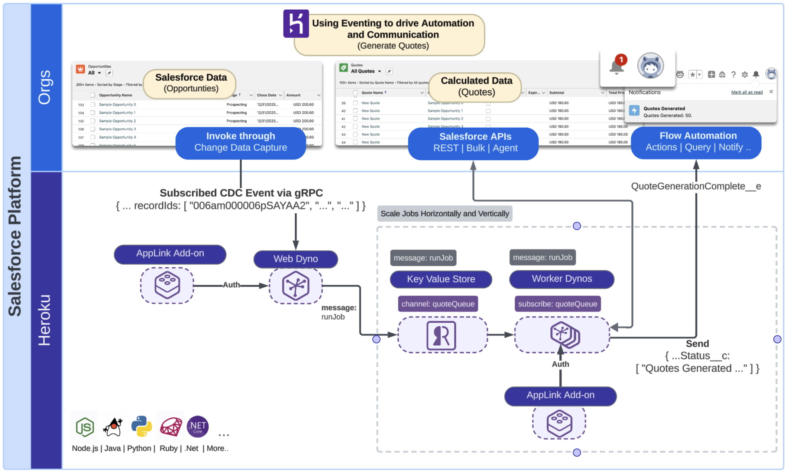

Heroku AppLink - Using Eventing to drive Automation and Communication (Java)
===============================================================================


This sample extends the [batch job sample](https://github.com/heroku-examples/heroku-integration-pattern-org-job-java) by adding the ability to use Salesforce Change Data Capture (CDC) events via the Pub/Sub API to start the work and notify users once it completes using [Custom Notifications](https://help.salesforce.com/s/articleView?id=platform.notif_builder_custom.htm&type=5). These notifications are sent to the user's desktop or mobile device running Salesforce Mobile. Flow is used in this sample to demonstrate how processing can be handed off to low-code tools such as Flow.


# Architecture Overview

The scenario used in this sample illustrates a basis for processing small to large volumes of Salesforce data using elastically scalable Heroku worker processes that execute complex compute calculations based on platform events such as Salesforce CDC events. In this case when **Opportunity** data is updated it is read and calculated pricing data is stored in an associated **Quote**. Calculating quote information from opportunities can become quite intensive, especially when large multinational businessess have complex rules that impact pricing related to region, products, and discount thresholds. It's also possible that such code already exists, and there is a desire to reuse it within a Salesforce context. 



This sample in contrast to the [Scaling Batch Jobs with Heroku - Java](https://github.com/heroku-examples/heroku-applink-pattern-org-job-java) sample uses event based patterns to control processing rather than explicit user invocation to start the bulk job. The result is that work is processed as needed rather than in batch. The choice over streaming execution vs batch execution of your workloads depends on your use case needs, some businesses needs prefer data to change periodically vs ongoing for example financial month end or year end calculations.

Technically speaking, this sample shares much of the same setup as the one mentioned above, as it is even more important for streaming event processing to respond quickly. As such it also includes two process types `web` and `worker`, both can be scaled vertically and horizontally to speed up processing and response times. The `web` process will receive CDC events via the Salesforce Pub/Sub API and `worker` will execute the jobs asynchronously. A [Heroku Key Value Store](https://elements.heroku.com/addons/heroku-redis) is used to create means to communicate between the two processes.

> [!NOTE]
> This sample could be considered an alternative to using Apex Platform Event Subscriptions if your data volumes and/or compute complexity requires it. In addition Heroku worker processes scale elastically and can thus avoid queue wait times impacting processing time that can occur with Batch Apex. For further information see **Technical Information** below.

# Requirements
- Heroku login
- Heroku CLI installed
- Heroku AppLink plugin is installed
- Salesforce CLI installed
- Login information for one or more Scratch, Development or Sandbox orgs


# Setting up your Salesforce Org

Steps below leverage the `sf` CLI as well so please ensure you have authenticated your org already - if not you can use this command:

```
sf org login web --alias my-org
```

This sample illustrates passing over processing to a Flow, use the following command to deploy to your Salesforce org:

```
sf project deploy start -o my-org
```

> [!NOTE]
> If you want to skip ahead and know more about what was just deployed see section **Transitioning Processing back to Flow or Apex**.

# Local Development and Testing

This section focuses on how to develop and test locally before deploying to Heroku and testing from within a Salesforce org. Using the `heroku local` command we can easily launch the required processes from one command. The commands in this section allow you to run the sample locally against a remotely provisioned [Heroku Key Value Store](https://devcenter.heroku.com/articles/heroku-redis) and access data within your Salesforce org.

> [!IMPORTANT]
> If have deployed the application, as described below and want to return to local development, you may want to destroy it to avoid race conditions since both will share the same job queue, use `heroku destroy`. In real situation you would have a different queue store for developer vs production.

Even though we are running and testing locally, we will still configure required aspects of the **Heroku AppLink** add-on to allow the code to authenticate and interact with your Salesforce Org as it would once deployed. Additionally the Heroku Key Value Store is used to manage a job queue for processing requests. Start with the following commands to create an empty application, configure the addons and run the sample code locally:


```
heroku create
heroku addons:create heroku-redis:mini --wait
heroku addons:create heroku-applink --wait
heroku salesforce:authorizations:add my-org
heroku config:set CONNECTION_NAMES=my-org
heroku config --shell > .env
mvn clean package
heroku local web=1,worker=1
```

To test the application locally, you have two options:

## Option 1: Simulate a CDC Event (Recommended for Testing)

To simulate a CDC event locally, use the sample CDC event payload stored in the `opportunity-cdc-event.json` file. Open this file and be sure to edit the `recordIds` value with a valid **Opportunity** Id from your Salesforce org. Note that it is important to anticipate multiple record Ids in one event, as such the code in this sample also considers this.

```json
{
  "ChangeEventHeader": {
    "entityName": "Opportunity",
    "recordIds": [
      "001am000019vFalAAE"
    ],
    "changeType": "UPDATE",
    "transactionKey": "00001b0b-bd8a-108c-cdeb-2b85f1c4b7e3"
  }
}
```

Use the following command to simulate a Salesforce Change Data Capture event being processed by the application:

```
curl -X POST http://localhost:8080/api/testevent \
     -H "Content-Type: application/json" \
     -d @opportunity-cdc-event.json
```

## Option 2: Create Sample Data and Trigger Real CDC Events

Alternatively, you can create sample Opportunity records and then update them to trigger real CDC events:

```
curl -X POST "http://localhost:8080/api/datacreate?numberOfOpportunities=5"
```

This will create 5 sample Opportunity records in your Salesforce org. Then update some Opportunity records in your Salesforce org to trigger CDC events. You can do this through the Salesforce UI by:
1. Navigate to the **Opportunities** tab
2. Select multiple opportunities 
3. Use the bulk edit feature to update fields like **Stage** or **Amount**

Login to your Salesforce org and you should see a notification as shown below:


> [!NOTE]
> For more information on how the notification above was handled review the next section before deploying.

Observe the logs from the `heroku local` command and you will see the CDC events were received via Pub/Sub, batched, and processed:

```
web.1 | SalesforcePubSubService : Starting Salesforce Pub/Sub subscription...
web.1 | SalesforcePubSubService : Connecting to Salesforce Pub/Sub API for tenant: 00Dam00000ecSlDEAU
web.1 | PricingEngineService : Processing CDC event for entity: Opportunity, changeType: UPDATE
web.1 | PricingEngineService : Processed CDC event with transaction key: 00001b0b-bd8a-108c-cdeb-2b85f1c4b7e3
web.1 | PricingEngineService : Enqueuing job for transactionKey: 00001b0b-bd8a-108c-cdeb-2b85f1c4b7e3 with records: 006am000006pSAYAA2,006am000006pSAYAA3,006am000006pSAYAA4,006am000006pSAYAA5,006am000006pSAYAA6
web.1 | PricingEngineService : Job enqueued with ID: ce9dd4bd-8544-422b-8879-c7a30e36176b for message: 006am000006pSAYAA2,006am000006pSAYAA3,006am000006pSAYAA4,006am000006pSAYAA5,006am000006pSAYAA6 to channel: quoteQueue
worker.1 | PricingEngineWorkerService : Worker received job with ID: 2966bc35-c14e-4d9a-9a8e-ed74ce57b3e9
worker.1 | PricingEngineWorkerService : Processing 5 Opportunities
worker.1 | PricingEngineWorkerService : Performing bulk insert for 5 Quotes
worker.1 | PricingEngineWorkerService : Job processing completed for Job ID: 2966bc35-c14e-4d9a-9a8e-ed74ce57b3e9
```

Finally you can also observe the **Quote** that was created by navigating to the **Quotes** related list on the **Opportunity** record page and click on the record:


# Transitioning Processing back to Flow or Apex

This sample illustrates how processing can be handed off to Salesforce Flow using Platform Events. This section outlines in further detail how this is done. Earlier in these steps you deployed some metadata to your Salesforce org, as confirmed by the output of the `sf deploy` command:

```
┌───────────┬──────────────────────────────────────┬────────────────────────────┬────────────────────────────────────────────────────────────────────────────────────────────┐
│ State     │ Name                                 │ Type                       │ Path                                                                                       │
├───────────┼──────────────────────────────────────┼────────────────────────────┼────────────────────────────────────────────────────────────────────────────────────────────┤
│ Created   │ QuoteGenerationComplete__e.Status__c │ CustomField                │ src-org/main/default/objects/QuoteGenerationComplete__e/fields/Status__c.field-meta.xml    │
│ Created   │ QuoteGenerationComplete              │ CustomNotificationType     │ src-org/main/default/notificationtypes/QuoteGenerationComplete.notiftype-meta.xml          │
│ Created   │ QuoteGenerationComplete__e           │ CustomObject               │ src-org/main/default/objects/QuoteGenerationComplete__e/QuoteGenerationComplete__e.object- │
│           │                                      │                            │ meta.xml                                                                                   │
│ Created   │ QuoteGenerationComplete              │ Flow                       │ src-org/main/default/flows/QuoteGenerationComplete.flow-meta.xml                           │
│ Created   │ ChangeEvents_OpportunityChangeEvent  │ PlatformEventChannelMember │ src-org/main/default/platformEventChannelMembers/ChangeEvents_OpportunityChangeEvent.platf │
│           │                                      │                            │ ormEventChannelMember-meta.xml                                                             │
└───────────┴──────────────────────────────────────┴────────────────────────────┴────────────────────────────────────────────────────────────────────────────────────────────┘
```

The sample code not only reacts to events from the Salesforce org (Salesforce CDC events) but also sends events as well, such as the `QuoteGenerationComplete__e` event above. This pattern enables the ability to for logic built with Apex or Flow to react or continue with further processing, such as the `QuoteGenerationComplete` flow deployed above. 

The Flow is triggered when an event is received on `QuoteGenerationComplete__e` event which sends a [custom notificaiton](https://help.salesforce.com/s/articleView?id=platform.flow_ref_elements_actions_sendcustomnotification.htm&type=5) to the user (as shown above). This is intentionally a simple Flow. Your Flow (or Apex) logic can do updates to other records, send emails, start other Flows or even invokes an Agent!


> [!NOTE]
> In reality you would think carefully about notifications, this sample is illustrative only and would potentially result in a lot of notifications to the user without any kind of filtering or logging elsewhere.

Here is the platform event definition that was deployed to your org:


# Deployment and Bulk Event Testing

> [!IMPORTANT]
> Check you are not still running the application locally. If you want to start over at any time use `heroku destroy` to delete your app.

Create the application and provision the add-ons:

```
heroku create
heroku addons:create heroku-redis:mini --wait
heroku addons:create heroku-applink --wait
```

Next ensure that the add-on is connected to your Salesforce org:

```
heroku salesforce:authorizations:add my-org
heroku config:set CONNECTION_NAMES=my-org
```

Next deploy the application and scale both the `web` and `worker` processes to run on a single dyno each. If your worker is not scaling, login to the Heroku Dashboard and check the configuration of the Dyno allows it.

```
git push heroku main
heroku ps:scale web=1,worker=1
```

Run the `heroku logs --tail` command to confirm the app is up and running and to monitor the logs as processing takes place.

Now trigger some Salesforce CDC events by making edits to one or more Opportunity records from within Salesforce. Use the **Opportunities** tab and the multi-record edit feature as shown below:


The above bulk edit resulted in 50 Quotes being created, which is shown via a single notification as shown below:


You can also navigate to the **Quotes** tab in your org or one of the sample **Opportunities** to review the generated quotes. You can re-run the above steps as many times as you like it will simply keep adding **Quotes** to the edited Opportunities. It is also worth observing the Heroku logs as shown below:

```
web.1 SalesforcePubSubService : Connecting to Salesforce Pub/Sub API for tenant: 00Dam00000ecSlDEAU
web.1 SalesforcePubSubService : Starting subscription loop for Opportunity CDC events
web.1 SalesforcePubSubService : Received 49 events from Pub/Sub API
web.1 PricingEngineService : Processing CDC event for entity: Opportunity, changeType: UPDATE
web.1 PricingEngineService : Processed CDC event with transaction key: 0000aecf-58f7-e513-929b-04259321a0cc
web.1 PricingEngineService : Enqueuing job for transactionKey: 0000aecf-58f7-e513-929b-04259321a0cc with records: 006am000006pSAYAA2,006am000006pSAYAA3,...
web.1 PricingEngineService : Job enqueued with ID: 8efeda4e-f1fd-4907-a26d-98cd7553d899 for message: 006am000006pSAYAA2,006am000006pSAYAA3,... to channel: quoteQueue
worker.1 PricingEngineWorkerService  : Worker received job with ID: 8efeda4e-f1fd-4907-a26d-98cd7553d899
worker.1 PricingEngineWorkerService  : Processing 50 Opportunities
worker.1 PricingEngineWorkerService  : Performing bulk insert for 50 Quotes
worker.1 PricingEngineWorkerService  : Creating records from index 0 to 49 (50 records)
worker.1 PricingEngineWorkerService  : Performing bulk insert for 29 QuoteLineItems
worker.1 PricingEngineWorkerService  : Creating records from index 0 to 28 (29 records)
worker.1 PricingEngineWorkerService   : Job processing completed for Job ID: 8efeda4e-f1fd-4907-a26d-98cd7553d899
```

Salesforce transmits a `transactionKey` with each Salesforce CDC event that has been used to buffer events from the same transaction into one job.

# Technical Information


- The application connects directly to the Salesforce Pub/Sub API using gRPC to receive Change Data Capture events in real-time. The **Heroku AppLink** add-on is used for authentication. This allows the worker jobs to request a Salesforce org authentication for their processing. Note that in constrast with the [batch job sample](https://github.com/heroku-examples/heroku-integration-pattern-org-job-java) this user is not necessarily the user that triggered the events. It is important to ensure the user used has all the applicable permissions to perform the work required.
- Events are not filtered in this sample, so any changes to **Opportunities** result in CDC events triggering **Quote** generation. The Pub/Sub API supports filtering, so you could configure the subscription to only process events when the `StageName` is of a certain value, e.g. `Proposal/Quote`. This would be implemented in the `SalesforcePubSubService` class.
- [Spring Boot](https://spring.io/projects/spring-boot) is used in this sample to provide a robust web application framework for managing the Pub/Sub subscription and job processing.
- The class `SalesforcePubSubService` implements the Pub/Sub gRPC client that receives the subscribed Salesforce CDC events and passes them to `PricingEngineService.java`.
- The class `PricingEngineService.java` contains logic to bulk create and destroy Opportunities. This logic is used for testing the sample with sample data creation and cleanup. It also batches up work for more optimal bulk processing within one transaction of CDC events received from Salesforce.
- The `CONNECTION_NAMES` environment variable is used by this sample to provide the alias of the connected Salesforce org given to the `salesforce:authorizations:add` command. See `SalesforceClient.java` for how its handled.


Other Samples
-------------

| Sample | What it covers? |
| ------ | --------------- |

| [Salesforce API Access - Java](https://github.com/heroku-examples/heroku-integration-pattern-api-access-java) | This sample application showcases how to extend a Heroku web application by integrating it with Salesforce APIs, enabling seamless data exchange and automation across multiple connected Salesforce orgs. It also includes a demonstration of the Salesforce Bulk API, which is optimized for handling large data volumes efficiently. |
| [Extending Apex, Flow and Agentforce - Java](https://github.com/heroku-examples/heroku-integration-pattern-org-action-java) | This sample demonstrates importing a Heroku application into an org to enable Apex, Flow, and Agentforce to call out to Heroku. For Apex, both synchronous and asynchronous invocation are demonstrated, along with securely elevating Salesforce permissions for processing that requires additional object or field access. |
| [Scaling Batch Jobs with Heroku - Java](https://github.com/heroku-examples/heroku-integration-pattern-org-job-java) | This sample seamlessly delegates the processing of large amounts of data with significant compute requirements to Heroku Worker processes. It also demonstrates the use of the Unit of Work aspect of the SDK (JavaScript only for the pilot) for easier utilization of the Salesforce Composite APIs. |
| [Using Eventing to drive Automation and Communication - Java](https://github.com/heroku-examples/heroku-integration-pattern-eventing-java) | This sample extends the batch job sample by adding the ability to use Salesforce Change Data Capture events via the Pub/Sub API to start the work and notify users once it completes using Custom Notifications. These notifications are sent to the user's desktop or mobile device running Salesforce Mobile. Flow is used in this sample to demonstrate how processing can be handed off to low-code tools such as Flow. |
